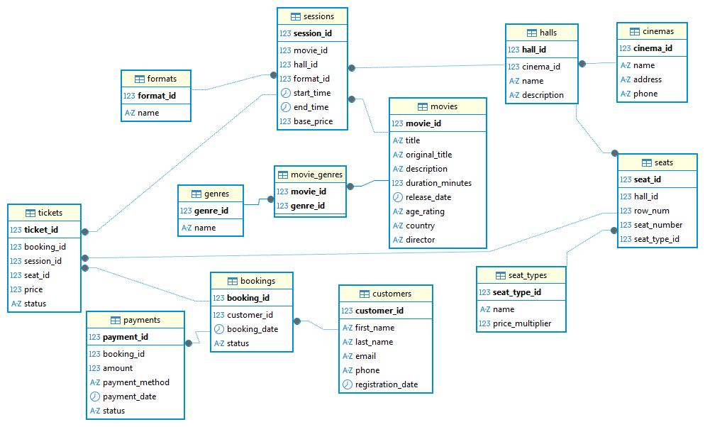

# CinemaDB

Схема данных для системы
управления кинотеатром — кинотеатр с несколькими залами, сеансами и продажей
билетов клиентам.

## Структура проекта

```
CinemaDB/
├── README.md                  — этот файл
├── docs/
│   ├── logical-model.md       — логическая модель: сущности, атрибуты, типы,
│   │                             связи, ER-диаграмма, обоснование нормализации
│   ├── eav-model.md           — EAV-модель гибких атрибутов фильма (ДЗ №2)
│   └── performance-report.md  — анализ производительности запросов (ДЗ №3)
└── sql/
    ├── 01_ddl.sql              — DDL: создание БД и всех таблиц (MySQL 8.x)
    ├── 02_seed.sql             — тестовые данные для проверки схемы
    ├── 03_queries.sql          — запрос «самый прибыльный фильм»
    ├── 04_eav_ddl.sql          — DDL: EAV-таблицы для гибких атрибутов фильма
    ├── 05_eav_seed.sql         — демонстрационные данные для EAV
    ├── 06_eav_queries.sql      — EAV-views и проверочный запрос
    ├── 07_perf_queries.sql     — 6 запросов (2 простых + 4 сложных)
    ├── 08_perf_seed_gen_10k.sql — генератор данных, этап 1 (~10 000 строк)
    ├── 09_perf_seed_gen_10m.sql — генератор данных, этап 2 (~10 000 000 строк)
    └── 10_perf_indexes.sql     — индексы по итогам анализа
```

## Схема данных

Кинотеатр (`cinemas`) состоит из залов (`halls`). Каждый зал имеет свою схему
мест (`seats`) — конкретные ряд/место с типом (`seat_types`: Стандарт/Комфорт/
VIP), от которого зависит наценка к цене билета. В залах проходят сеансы
(`sessions`) — показы фильмов (`movies`) в определённом формате (`formats`:
2D/3D/...) с собственной базовой ценой. Клиенты (`customers`) оформляют заказы
(`bookings`), в которые входят билеты (`tickets`) на конкретные места
конкретных сеансов; заказ оплачивается (`payments`).

Подробное описание — в [docs/logical-model.md](docs/logical-model.md).



Ключевые проектные решения:

- **Цена билета не фиксированная** — зависит от базовой цены сеанса
  (`sessions.base_price`, разная для разных форматов/времени) и от типа места
  (`seat_types.price_multiplier`). Итоговая цена вычисляется при продаже и
  сохраняется в `tickets.price`, чтобы не «плыть» задним числом при изменении
  тарифов.
- **Схема зала** смоделирована через отдельную таблицу `seats` (ряд, место,
  тип), а не просто как число мест в зале — это позволяет продавать конкретные
  места и не допускать двойного бронирования одного места на один сеанс
  (`UNIQUE (session_id, seat_id)` в `tickets`).
- Схема нормализована до 3НФ (жанры, форматы, типы мест — в справочниках,
  без дублирования и текстовых списков).

## Как развернуть

Требуется MySQL 8.x. Выполнить по порядку:

```bash
mysql -u root < sql/01_ddl.sql      # создаёт БД cinemadb и таблицы
mysql -u root < sql/02_seed.sql     # (опционально) заполняет тестовыми данными
mysql -u root < sql/03_queries.sql  # выполняет аналитический запрос
```

Скрипты проверены на локальном MySQL 8.4.

## Самый прибыльный фильм

Запрос в [sql/03_queries.sql](sql/03_queries.sql) считает суммарную выручку
по проданным билетам (`status IN ('paid', 'used')`) в разрезе фильма и
возвращает фильм с максимальной выручкой:

```sql
SELECT
    m.movie_id,
    m.title,
    SUM(t.price)       AS total_revenue,
    COUNT(t.ticket_id) AS tickets_sold
FROM tickets t
JOIN sessions s ON s.session_id = t.session_id
JOIN movies m   ON m.movie_id   = s.movie_id
WHERE t.status IN ('paid', 'used')
GROUP BY m.movie_id, m.title
ORDER BY total_revenue DESC
LIMIT 1;
```

На тестовых данных из `02_seed.sql` результат:

| movie_id | title | total_revenue | tickets_sold |
|---|---|---|---|
| 1 | Начало | 1510.00 | 3 |

## EAV: гибкие атрибуты фильмов

Поверх основной схемы добавлена EAV-подсистема для хранения разнотипных
атрибутов фильма без изменения нормализованной схемы кинотеатра: рецензии
(текст), премии (логическое значение), важные и служебные даты, числовые
показатели (рейтинги, кассовые сборы). Подробности — в
[docs/eav-model.md](docs/eav-model.md).

```
CinemaDB/
└── sql/
    ├── 04_eav_ddl.sql     — DDL: attribute_types, attributes, attribute_values
    ├── 05_eav_seed.sql    — демонстрационные данные по всем типам атрибутов
    └── 06_eav_queries.sql — views (v_marketing_attributes, v_service_tasks)
                              + проверочный запрос на структурную целостность
```

Развернуть после основной схемы:

```bash
mysql -u root < sql/04_eav_ddl.sql
mysql -u root < sql/05_eav_seed.sql
mysql -u root < sql/06_eav_queries.sql
```

## Анализ производительности

6 запросов, генератор тестовых данных (~10 000 и ~10 000 000 строк) и
сравнение планов выполнения до/после добавления индексов — подробности и
полные планы в [docs/performance-report.md](docs/performance-report.md).

```
CinemaDB/
└── sql/
    ├── 07_perf_queries.sql     — 6 запросов (2 простых + 4 сложных)
    ├── 08_perf_seed_gen_10k.sql — генератор данных, этап 1 (~10 000 строк)
    ├── 09_perf_seed_gen_10m.sql — генератор данных, этап 2 (~10 000 000 строк)
    └── 10_perf_indexes.sql     — индексы по итогам анализа
```
