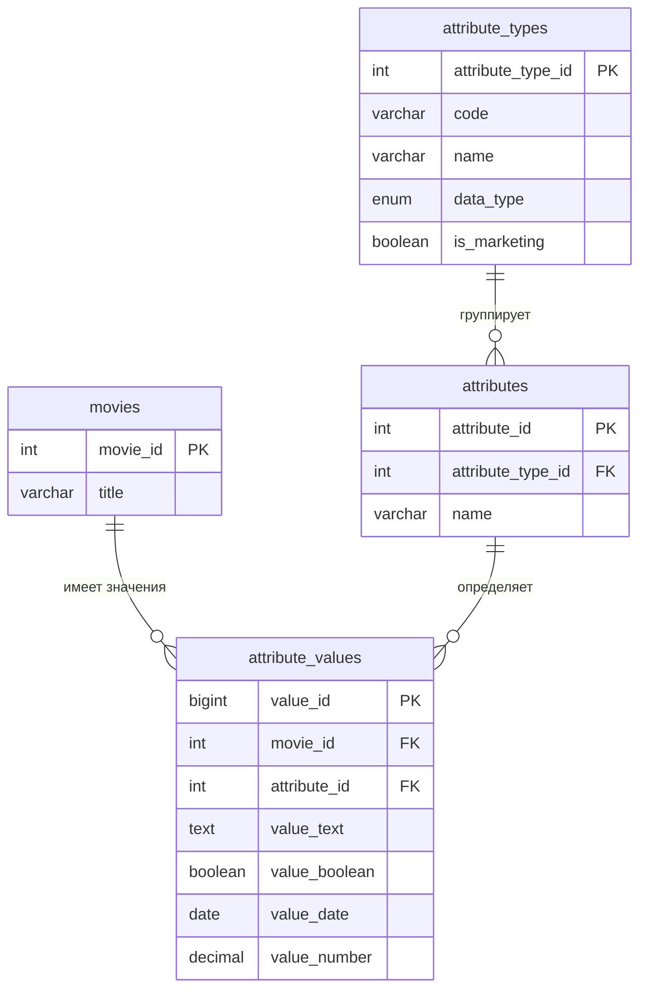

# EAV-модель «Атрибуты фильмов» (CinemaDB)

Дополнение к [logical-model.md](logical-model.md): гибкое
хранение разнотипных атрибутов фильма (рецензии, премии, важные и служебные
даты, числовые показатели) без изменения нормализованной схемы кинотеатра.

## 1. Зачем EAV

У фильма может быть произвольный, заранее не известный и растущий набор
характеристик разных типов: текстовые рецензии, логические признаки премий,
даты, числовые показатели. Добавлять для каждой характеристики отдельную
колонку в `movies` означало бы постоянные миграции схемы и NULL-разреженную
таблицу. EAV выносит эти характеристики в отдельную подсхему из 3 таблиц,
не трогая нормализованную схему кинотеатра.

## 2. Сущности

| # | Сущность | Назначение |
|---|----------|------------|
| 1 | `attribute_types` | Справочник типов атрибутов: код, отображаемое имя, тип данных, флаг «для маркетинга» |
| 2 | `attributes` | Конкретные атрибуты (например, «Оскар», «Мировая премьера»), привязанные к типу |
| 3 | `attribute_values` | Значения атрибутов для конкретных фильмов, по 4 типизированным колонкам |
| — | `movies` | Переиспользуется из основной схемы (см. logical-model.md) |

## 3. Атрибуты, типы данных, ключи

### attribute_types
| Поле | Тип | Ограничения |
|---|---|---|
| attribute_type_id | INT UNSIGNED | PK, AUTO_INCREMENT |
| code | VARCHAR(30) | NOT NULL, UNIQUE |
| name | VARCHAR(100) | NOT NULL |
| data_type | ENUM('text','boolean','date','number') | NOT NULL |
| is_marketing | BOOLEAN | NOT NULL, DEFAULT TRUE |
| description | VARCHAR(255) | |

### attributes
| Поле | Тип | Ограничения |
|---|---|---|
| attribute_id | INT UNSIGNED | PK, AUTO_INCREMENT |
| attribute_type_id | INT UNSIGNED | FK → attribute_types.attribute_type_id, NOT NULL |
| name | VARCHAR(150) | NOT NULL |
| description | VARCHAR(255) | |
| | | UNIQUE (attribute_type_id, name) |

### attribute_values
| Поле | Тип | Ограничения |
|---|---|---|
| value_id | BIGINT UNSIGNED | PK, AUTO_INCREMENT |
| movie_id | INT UNSIGNED | FK → movies.movie_id, NOT NULL, ON DELETE CASCADE |
| attribute_id | INT UNSIGNED | FK → attributes.attribute_id, NOT NULL |
| value_text | TEXT | |
| value_boolean | BOOLEAN | |
| value_date | DATE | |
| value_number | DECIMAL(12,3) | |
| created_at | DATETIME | NOT NULL, DEFAULT CURRENT_TIMESTAMP |
| | | UNIQUE (movie_id, attribute_id) |
| | | INDEX (attribute_id) |
| | | INDEX (value_date) |

## 4. Типы данных и специфика float

Каждому `attribute_types.data_type` соответствует ровно одна типизированная
колонка в `attribute_values`:

| data_type | Колонка | Пример атрибута |
|---|---|---|
| text | value_text | Рецензия критика |
| boolean | value_boolean | Оскар (получен/нет) |
| date | value_date | Мировая премьера / дата начала продажи билетов |
| number | value_number | Рейтинг критиков, кассовые сборы |

**Почему `DECIMAL(12,3)`, а не `FLOAT`/`DOUBLE`:** `FLOAT`/`DOUBLE` — двоичные
типы с плавающей точкой. Многие десятичные дроби (например, `8.8`) не имеют
точного представления в двоичном виде, из-за чего накапливается ошибка
округления, а сравнения на равенство (`value_number = 8.8`) могут неожиданно
не срабатывать после серии арифметических операций. `DECIMAL` хранит число
как точное десятичное значение — это критично для рейтингов и денежных
показателей (кассовые сборы), где нужны точные сравнения и суммирование без
накопления погрешности.

У любой корректной строки `attribute_values` заполнена ровно одна из 4
типизированных колонок — та, что соответствует `data_type` атрибута.
Это не проверяется триггером или CHECK-констрейнтом (см. раздел 6) —
целостность проверяется отдельным SQL-запросом.

## 5. Views

### `v_marketing_attributes`
Колонки: `movie_id`, `movie_title`, `attribute_type`, `attribute_name`,
`value_display`. Разворачивает все атрибуты с `attribute_types.is_marketing =
TRUE` (рецензии, премии, важные даты, числовые показатели — служебные даты
исключены, они не для печати/показа зрителю), значение всегда приведено к
тексту через `CASE` по `data_type`.

### `v_service_tasks`
Колонки: `movie_id`, `movie_title`, `tasks_today`, `tasks_in_20_days`.
Берёт только атрибуты типа `service_date`, агрегирует названия атрибутов
(`GROUP_CONCAT`) отдельно для тех, чья `value_date` равна `CURDATE()`, и
отдельно — `CURDATE() + INTERVAL 20 DAY`. View пересчитывается динамически
при каждом обращении.

## 6. Проверка целостности

EAV-схема не ограничивает на уровне СУБД, какая типизированная колонка
`attribute_values` должна быть заполнена для атрибута данного типа — это
осознанное решение (см. `docs/superpowers/specs/2026-07-20-eav-movie-attributes-design.md`,
решение №4): вместо триггеров используется отдельный проверочный SQL-запрос
в `sql/06_eav_queries.sql`, который находит строки с:

1. неверным количеством заполненных типизированных колонок (0 или ≥2);
2. заполненной колонкой, не соответствующей `data_type` атрибута.

На корректных данных запрос возвращает 0 строк.

## 7. ER-диаграмма



## 8. Как развернуть и проверить

```bash
mysql -u root < sql/01_ddl.sql        # база и основная схема (если ещё не развёрнута)
mysql -u root < sql/02_seed.sql       # тестовые данные основной схемы
mysql -u root < sql/04_eav_ddl.sql    # EAV-таблицы
mysql -u root < sql/05_eav_seed.sql   # EAV демо-данные
mysql -u root < sql/06_eav_queries.sql  # views + проверочный запрос + демонстрация
```
