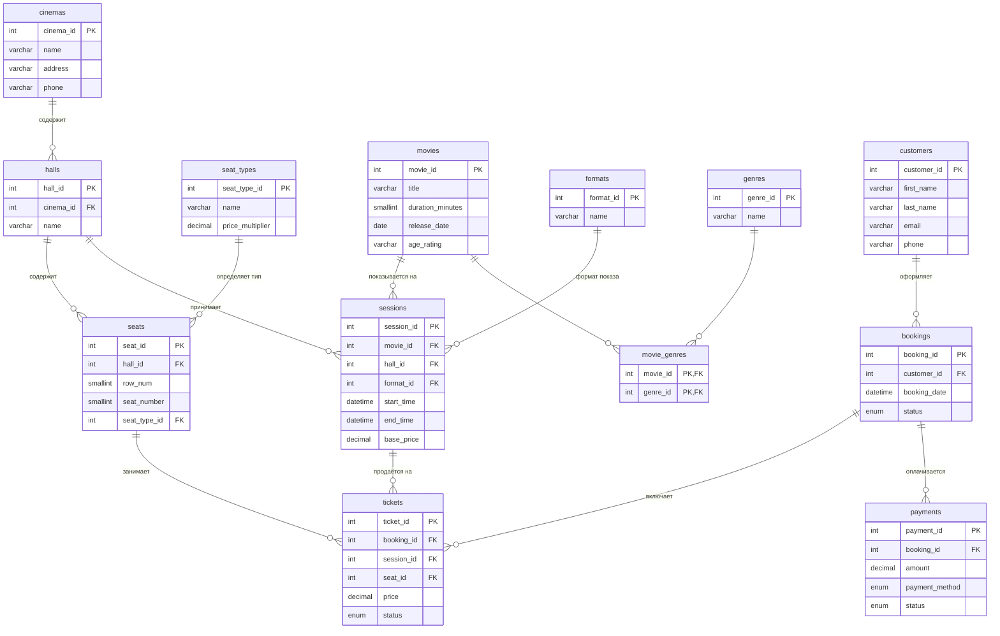

# Логическая модель БД «CinemaDB»

## 1. Предметная область

Система управления кинотеатром (или сетью кинотеатров):

- у кинотеатра несколько **залов**;
- в каждом зале проходит несколько **сеансов** (показов фильмов);
- клиенты покупают **билеты** на сеансы, билет привязан к конкретному **месту** в зале.

Ключевые наблюдения, повлиявшие на схему:

1. **Не все сеансы и места стоят одинаково.**
   Базовая цена зависит от сеанса (`sessions.base_price`) — она разная для дневных/вечерних
   показов, для 2D/3D/IMAX и т.д. Внутри одного сеанса цена дополнительно зависит от типа
   места (`seat_types.price_multiplier`: Стандарт/Комфорт/VIP). Итоговая цена билета
   вычисляется как `base_price * price_multiplier` и **фиксируется** в `tickets.price` в момент
   продажи, чтобы последующие изменения тарифов не меняли историю уже проданных билетов.

2. **Схема зала** — это не просто «вместимость», а набор конкретных мест с координатами
   (ряд, место) и типом. Поэтому места вынесены в отдельную сущность `seats`, которая и
   описывает физическую схему зала и позволяет продавать/бронировать каждое место отдельно
   и не допускать двойной продажи одного места на один сеанс.

## 2. Список сущностей

| # | Сущность | Назначение |
|---|----------|------------|
| 1 | `cinemas` | Кинотеатр (адрес, площадка сети) |
| 2 | `halls` | Зал конкретного кинотеатра |
| 3 | `seat_types` | Справочник типов мест и их наценки |
| 4 | `seats` | Конкретное место в конкретном зале (схема зала) |
| 5 | `genres` | Справочник жанров |
| 6 | `movies` | Фильм (карточка фильма) |
| 7 | `movie_genres` | Связь фильм ↔ жанр (M:N) |
| 8 | `formats` | Справочник форматов показа (2D/3D/IMAX/4DX) |
| 9 | `sessions` | Сеанс: показ фильма в зале в заданное время |
| 10 | `customers` | Клиент |
| 11 | `bookings` | Заказ клиента (может содержать несколько билетов) |
| 12 | `tickets` | Билет — место на сеансе в рамках заказа |
| 13 | `payments` | Оплата заказа |

## 3. Атрибуты, типы данных, ключи

### cinemas
| Поле | Тип | Ограничения |
|---|---|---|
| cinema_id | INT UNSIGNED | PK, AUTO_INCREMENT |
| name | VARCHAR(150) | NOT NULL |
| address | VARCHAR(255) | NOT NULL |
| phone | VARCHAR(20) | |

### halls
| Поле | Тип | Ограничения |
|---|---|---|
| hall_id | INT UNSIGNED | PK, AUTO_INCREMENT |
| cinema_id | INT UNSIGNED | FK → cinemas.cinema_id, NOT NULL |
| name | VARCHAR(50) | NOT NULL |
| description | VARCHAR(255) | |
| | | UNIQUE (cinema_id, name) |

### seat_types
| Поле | Тип | Ограничения |
|---|---|---|
| seat_type_id | INT UNSIGNED | PK, AUTO_INCREMENT |
| name | VARCHAR(50) | NOT NULL, UNIQUE |
| price_multiplier | DECIMAL(4,2) | NOT NULL, DEFAULT 1.00 |

### seats
| Поле | Тип | Ограничения |
|---|---|---|
| seat_id | INT UNSIGNED | PK, AUTO_INCREMENT |
| hall_id | INT UNSIGNED | FK → halls.hall_id, NOT NULL |
| row_num | SMALLINT UNSIGNED | NOT NULL |
| seat_number | SMALLINT UNSIGNED | NOT NULL |
| seat_type_id | INT UNSIGNED | FK → seat_types.seat_type_id, NOT NULL |
| | | UNIQUE (hall_id, row_num, seat_number) |

### genres
| Поле | Тип | Ограничения |
|---|---|---|
| genre_id | INT UNSIGNED | PK, AUTO_INCREMENT |
| name | VARCHAR(50) | NOT NULL, UNIQUE |

### movies
| Поле | Тип | Ограничения |
|---|---|---|
| movie_id | INT UNSIGNED | PK, AUTO_INCREMENT |
| title | VARCHAR(255) | NOT NULL |
| original_title | VARCHAR(255) | |
| description | TEXT | |
| duration_minutes | SMALLINT UNSIGNED | NOT NULL |
| release_date | DATE | |
| age_rating | VARCHAR(10) | |
| country | VARCHAR(100) | |
| director | VARCHAR(150) | |

### movie_genres
| Поле | Тип | Ограничения |
|---|---|---|
| movie_id | INT UNSIGNED | PK (составной), FK → movies.movie_id |
| genre_id | INT UNSIGNED | PK (составной), FK → genres.genre_id |

### formats
| Поле | Тип | Ограничения |
|---|---|---|
| format_id | INT UNSIGNED | PK, AUTO_INCREMENT |
| name | VARCHAR(20) | NOT NULL, UNIQUE |

### sessions
| Поле | Тип | Ограничения |
|---|---|---|
| session_id | INT UNSIGNED | PK, AUTO_INCREMENT |
| movie_id | INT UNSIGNED | FK → movies.movie_id, NOT NULL |
| hall_id | INT UNSIGNED | FK → halls.hall_id, NOT NULL |
| format_id | INT UNSIGNED | FK → formats.format_id, NOT NULL |
| start_time | DATETIME | NOT NULL |
| end_time | DATETIME | NOT NULL, CHECK (end_time > start_time) |
| base_price | DECIMAL(10,2) | NOT NULL |
| | | UNIQUE (hall_id, start_time) |

### customers
| Поле | Тип | Ограничения |
|---|---|---|
| customer_id | INT UNSIGNED | PK, AUTO_INCREMENT |
| first_name | VARCHAR(100) | NOT NULL |
| last_name | VARCHAR(100) | NOT NULL |
| email | VARCHAR(150) | UNIQUE |
| phone | VARCHAR(20) | UNIQUE |
| registration_date | DATETIME | NOT NULL, DEFAULT CURRENT_TIMESTAMP |

### bookings
| Поле | Тип | Ограничения |
|---|---|---|
| booking_id | INT UNSIGNED | PK, AUTO_INCREMENT |
| customer_id | INT UNSIGNED | FK → customers.customer_id, NOT NULL |
| booking_date | DATETIME | NOT NULL, DEFAULT CURRENT_TIMESTAMP |
| status | ENUM('pending','paid','cancelled') | NOT NULL, DEFAULT 'pending' |

### tickets
| Поле | Тип | Ограничения |
|---|---|---|
| ticket_id | INT UNSIGNED | PK, AUTO_INCREMENT |
| booking_id | INT UNSIGNED | FK → bookings.booking_id, NOT NULL |
| session_id | INT UNSIGNED | FK → sessions.session_id, NOT NULL |
| seat_id | INT UNSIGNED | FK → seats.seat_id, NOT NULL |
| price | DECIMAL(10,2) | NOT NULL |
| status | ENUM('booked','paid','cancelled','used') | NOT NULL, DEFAULT 'booked' |
| | | UNIQUE (session_id, seat_id) — защита от двойной продажи места |

### payments
| Поле | Тип | Ограничения |
|---|---|---|
| payment_id | INT UNSIGNED | PK, AUTO_INCREMENT |
| booking_id | INT UNSIGNED | FK → bookings.booking_id, NOT NULL |
| amount | DECIMAL(10,2) | NOT NULL |
| payment_method | ENUM('cash','card','online') | NOT NULL |
| payment_date | DATETIME | NOT NULL, DEFAULT CURRENT_TIMESTAMP |
| status | ENUM('success','failed','refunded') | NOT NULL |

## 4. Связи

- `cinemas (1) — (N) halls`
- `halls (1) — (N) seats`
- `seat_types (1) — (N) seats`
- `halls (1) — (N) sessions`
- `movies (1) — (N) sessions`
- `formats (1) — (N) sessions`
- `movies (N) — (N) genres` через `movie_genres`
- `customers (1) — (N) bookings`
- `bookings (1) — (N) tickets`
- `sessions (1) — (N) tickets`
- `seats (1) — (N) tickets`
- `bookings (1) — (N) payments`

## 5. ER-диаграмма

## 6. Нормализация

Схема приведена к третьей нормальной форме (3НФ):

- **1НФ**: все атрибуты атомарны (например, жанры фильма не хранятся строкой через запятую,
  а вынесены в отдельную связующую таблицу `movie_genres`; ряд/место не смешаны в одном поле).
- **2НФ**: в таблицах с составным ключом (`movie_genres`) нет неключевых атрибутов, зависящих
  только от части ключа — там вообще нет неключевых атрибутов.
- **3НФ**: устранены транзитивные зависимости. В частности:
  - тип места и его наценка вынесены в `seat_types`, а не дублируются в каждой строке `seats`;
  - жанр и формат вынесены в справочники `genres`/`formats`, а не хранятся текстом в `movies`/`sessions`;
  - данные клиента не дублируются в `bookings`/`tickets`, а связаны через `customer_id`.

Намеренное отступление от строгой нормализации: `tickets.price` дублирует (в вычисляемом виде)
`sessions.base_price * seat_types.price_multiplier`. Это сделано осознанно — это не ошибка
проектирования, а бизнес-требование: цена билета должна оставаться неизменной после покупки,
даже если впоследствии изменится цена сеанса или наценка типа места.
